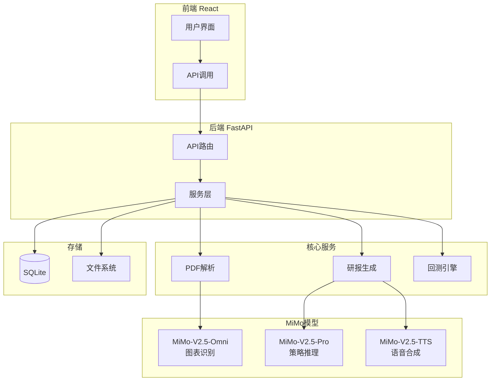

# MiMo-FinRobot 视频解说稿

## 开头：我是谁，我为什么要做这个项目

大家好，我是一个刚接触AI开发才一周的新手。

说实话，一周前我完全没想过自己能做出一个像样的系统。我之前的工作跟编程没什么关系，就是个普通上班族。

但自从用了Claude Code和小米的MiMo模型之后，我发现了一件事：哪怕像我这样的小白，也能通过"说人话 + 让Agent干活"的方式，把一个复杂的想法落地。

这次我想做的是一个叫MiMo-FinRobot的项目——用MiMo模型做一套全自动的金融研报生成系统。

为什么选金融方向？因为小米开放了百万亿免费Token额度，我想试试MiMo到底强不强。结果一试，发现它真的能干活。

## 过程：我是怎么从零开始的

我的做法很简单：

1. **先让Claude Code帮我规划** - 我告诉它我想做什么，它就帮我生成了一份完整的项目计划，包括技术架构、模块划分、Token消耗估算。

2. **然后让它帮我搭骨架** - 我说"帮我创建FastAPI + React的项目结构"，它就自动帮我建好了目录，写好了配置文件。

3. **最后让它帮我写代码** - 我一个模块一个模块地说需求，比如"帮我写一个PDF解析服务"，它就用TDD的方式，先写测试再写实现。

整个过程中，我没有手写一行代码。但逻辑和决策都是我自己把关的——我会看它生成的代码对不对，需不需要调整。

## 演示：完整的工作流

让我给大家演示一下完整的工作流：

### 1. 上传财报PDF

在Web界面上，点击"上传PDF"按钮，选择一份财报文件。

### 2. 自动分析

点击"开始分析"，系统会自动：
- 用MiMo-V2.5-Omni识别PDF中的图表和表格
- 提取关键财务数据
- 用MiMo-V2.5-Pro生成投资策略分析
- 输出一份完整的研报

### 3. 量化回测

研报生成后，点击"创建回测"，系统会：
- 从研报中提取交易信号
- 用历史数据跑一遍策略
- 显示资金曲线和关键指标（收益率、最大回撤、夏普比率等）

### 4. 前端展示

所有结果都在Web界面上清晰展示，包括：
- 报告列表和状态
- 研报详细内容
- 回测结果和图表

## 优势：MiMo多模态能力

这个项目最大的亮点是MiMo的多模态能力：

- **MiMo-V2.5-Omni**：能读懂财报里的图表和表格，不只是文字
- **MiMo-V2.5-Pro**：能做复杂的推理和策略分析
- **MiMo-V2.5-TTS**：能把研报转成语音，方便听

作为一个新手，Agent把我的能力放大了至少10倍。以前我觉得"做一个金融分析系统"是不可能的事，现在一周就做出来了。

## 结尾：鼓励其他新手

我想对其他和我一样的新手说：

踩坑不可怕，关键是动手。

你不需要是程序员，不需要懂所有技术细节。你只需要有想法，然后让Agent帮你实现。

MiMo给了我们免费额度，Claude Code给了我们强大的开发工具。现在是最好的时代，普通人也能做出不普通的东西。

去试试吧，你真的可以！

---

## 10分钟B站视频大纲

| 时间段 | 内容 | 时长 |
|--------|------|------|
| 0:00-0:30 | 开场介绍：我是谁，为什么做这个项目 | 30秒 |
| 0:30-1:30 | MiMo模型介绍和免费额度 | 1分钟 |
| 1:30-3:00 | 项目架构讲解（配合Mermaid图） | 1.5分钟 |
| 3:00-4:30 | 演示：上传PDF → 自动分析 | 1.5分钟 |
| 4:30-6:00 | 演示：查看研报 → 创建回测 | 1.5分钟 |
| 6:00-7:00 | 代码结构展示（快速过一遍） | 1分钟 |
| 7:00-8:00 | MiMo多模态能力讲解 | 1分钟 |
| 8:00-9:00 | 新手心得：Agent如何放大能力 | 1分钟 |
| 9:00-10:00 | 结尾：鼓励大家动手试试 | 1分钟 |

## Mermaid架构图

## 技术栈清单

- 后端：FastAPI + SQLAlchemy + SQLite
- 前端：React + Vite + Recharts
- AI模型：MiMo-V2.5-Pro / Omni / TTS
- 开发工具：Claude Code + TDD流程

## 预期效果

- 单次报告生成：约28,800 tokens
- 月度消耗：约1.36M tokens
- 成本：约$5-10/月（使用免费额度可覆盖）
